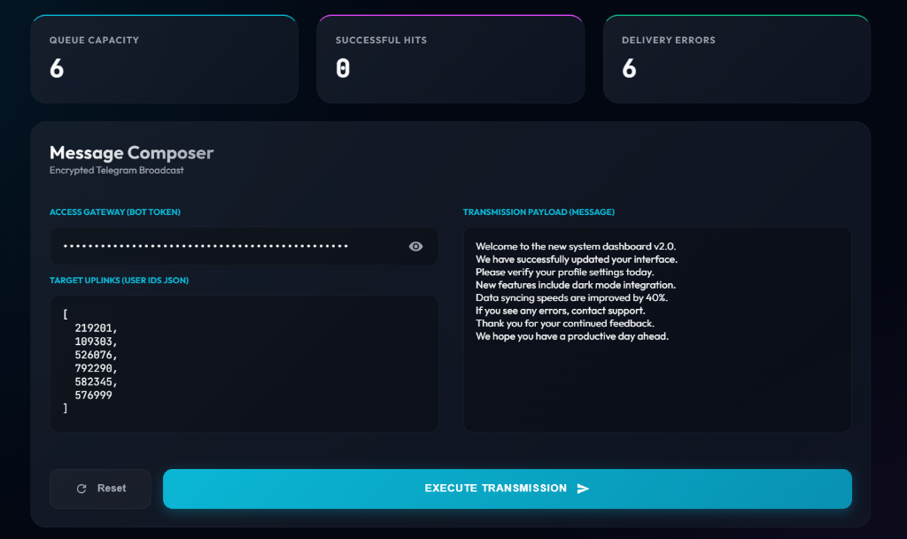

# TeleMsg Pro | Command Center 🌌


**TeleMsg Pro** is a high-end, futuristic command center designed for professional Telegram broadcasting. It transforms the simple task of sending notifications into a sophisticated mission-control experience, featuring real-time telemetry, a terminal-style monitor, and advanced glassmorphism aesthetics.



## 🚀 Key Features

- **Mission Dashboard**: Bento-grid layout with real-time stat widgets for Queue Capacity, Successful Hits, and Delivery Errors.
- **Terminal Monitor**: A coding-inspired, real-time execution log with precise timestamps and color-coded status flags.
- **Privacy Shield**: Secured "Access Gateway" (Bot Token) with a visibility toggle to keep your credentials safe from prying eyes.
- **Interactive Validation**: Real-time JSON validation for Target Uplinks with visual success/error indicators.
- **Cosmic Aesthetic**: Ultra-modern dark-mode design with deep frost effects and neon cyan/magenta accents.
- **Zero-Loss State**: Automatically persists your configuration in local storage, including the last sequence of logs.
- **Symmetrical Design**: Perfectly balanced UI that auto-scales technical textareas to maintain geometric alignment.

## 🛠️ Prerequisites

- **Python 3.x**
- A **Telegram Bot Token** from [@BotFather](https://t.me/BotFather).
- Recipient **Chat IDs** (Users must have started a conversation with your bot).

## �️ Installation

1.  **Clone the Repository**
    ```bash
    git clone https://github.com/s24hira/tele-msg.git
    cd tele-msg
    ```

2.  **Initialize Environment**
    ```bash
    pip install -r requirements.txt
    ```

3.  **Launch Sequence**
    ```bash
    python app.py
    ```

## 🎮 How to Operate

1.  **Access the Gateway**: Enter your Bot Token. Use the eye icon to toggle visibility.
2.  **Define Targets**: Input recipient IDs in a JSON array format. The "Queue Capacity" widget will update automatically.
    ```json
    [
      8023794433,
      8804919711
    ]
    ```
3.  **Prepare Payload**: Compose your message in the transmission box.
4.  **Execute Transmission**: Click the primary action button to start the broadcast. Watch the **Terminal Monitor** for live telemetry.
5.  **Reset Sequence**: Use the Reset button to wipe all local buffers and start fresh.

## 📄 License

Distributed under the MIT License. See `LICENSE` for more information.

---

**Disclaimer**: This tool is intended for legitimate notification services. Usage for unsolicited messaging (spamming) is a violation of Telegram's Terms of Service and may result in your bot being banned. Communicate responsibly.
